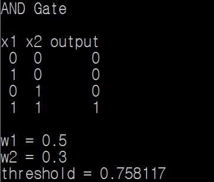
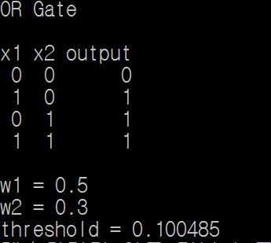
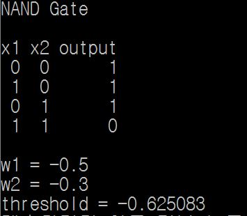
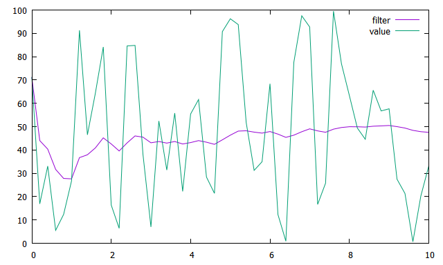
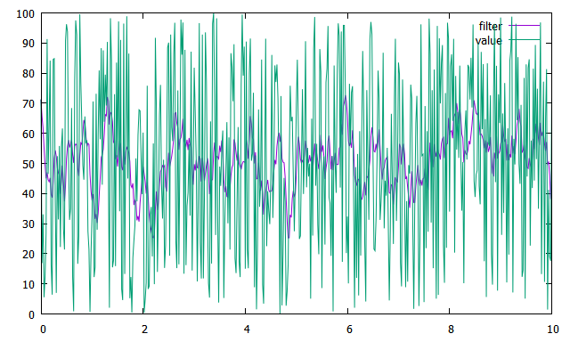

#INDEX
----
###1. Single Layer Perceptron
###2. Filter
----
##Single Layer Perceptron
각 논리식에 실질적으로 나와야 하는 값

	while (gate <= XOR)
	{
		std::string gate_str;
		switch (gate)
		{
			case AND:
				gate_str = "AND";
				y[0] = 0;
				y[1] = 0;
				y[2] = 0;
				y[3] = 1;
				break;
			case OR:
				gate_str = "OR";
				y[0] = 0;
				y[1] = 1;
				y[2] = 1;
				y[3] = 1;
				break;
			case NAND:
				gate_str = "NAND";
				y[0] = 1;
				y[1] = 1;
				y[2] = 1;
				y[3] = 0;
				break;
			case XOR:
				gate_str = "XOR";
				y[0] = 0;
				y[1] = 1;
				y[2] = 1;
				y[3] = 0;
				break;
			default:
				break;
		}
	}

##
실질적인 값과 비교 후 값이 다를 경우에 임계값에 난수를 주어 일치하는 값이 나올때 까지 비교 (NAND의 경우에는 음의 가중치를 두게 함)

	for (int i = 0;i < 4;)
		{
			output[i] = w1*x1[i] + w2*x2[i] > threshold ? 1 : 0;
			if (y[i] == output[i])
				i++;
			else
			{
				if (gate == NAND)
				{
					w1 *= -1;
					w2 *= -1;
				}
				threshold = dist(eng);
				i = 0;
			}
		}

##

##Filter
###Average Filter
이전 필터값 재귀로 구현

	double avgfilter(double newval, double prefilter, int valcnt)
	{
	double newfilter;

	if (prefilter != 0.0)
		newfilter = prefilter * (valcnt - 1) / valcnt + newval / valcnt;
	else
		newfilter = newval;

	return newfilter;
	}

###Moving Average Filter
STL 라이브러리 큐를 사용하여 구현

	double movingavgfilter(double newval, double prefilter, std::queue<double>* Q)
	{
	double newfilter;
	double sumval = 0.0;
	std::queue<double> tmpQ;
	
	Q->push(newval);
	tmpQ = *Q;

	if (tmpQ.size() != SIZE)
		sumval = tmpQ.front() * (SIZE - tmpQ.size());

	while (!tmpQ.empty())
	{
		sumval += tmpQ.front();
		tmpQ.pop();
	}
	newfilter = sumval / SIZE;

	if (Q->size() == SIZE)
		Q->pop();

	return newfilter;
	}

