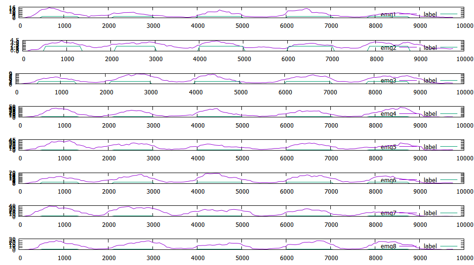

#1주차
----
###1. Single Layer Perceptron
###2. Filter
----
##Single Layer Perceptron
각 논리식에 실질적으로 나와야 하는 값

	while (gate <= XOR)
	{
		std::string gate_str;
		switch (gate)
		{
			case AND:
				gate_str = "AND";
				y[0] = 0;
				y[1] = 0;
				y[2] = 0;
				y[3] = 1;
				break;
			case OR:
				gate_str = "OR";
				y[0] = 0;
				y[1] = 1;
				y[2] = 1;
				y[3] = 1;
				break;
			case NAND:
				gate_str = "NAND";
				y[0] = 1;
				y[1] = 1;
				y[2] = 1;
				y[3] = 0;
				break;
			case XOR:
				gate_str = "XOR";
				y[0] = 0;
				y[1] = 1;
				y[2] = 1;
				y[3] = 0;
				break;
			default:
				break;
		}	
	}
	
##
실질적인 값과 비교 후 값이 다를 경우에 임계값에 난수를 주어 일치하는 값이 나올때 까지 비교 (NAND의 경우에는 음의 가중치를 두게 함)

	for (int i = 0;i < 4;)
		{
			output[i] = w1*x1[i] + w2*x2[i] > threshold ? 1 : 0;
			if (y[i] == output[i])
				i++;
			else
			{
				if (gate == NAND)
				{
					w1 *= -1;
					w2 *= -1;
				}
				threshold = dist(eng);
				i = 0;
			}
		}

##

##Filter
###Average Filter
이전 필터값 재귀로 구현

	double avgfilter(double newval, double prefilter, int valcnt)
	{
	double newfilter;

	if (prefilter != 0.0)
		newfilter = prefilter * (valcnt - 1) / valcnt + newval / valcnt;
	else
		newfilter = newval;

	return newfilter;
	}

###Moving Average Filter
STL 라이브러리 큐를 사용하여 구현

	double movingavgfilter(double newval, double prefilter, std::queue<double>* Q)
	{
		double newfilter;
		double sumval = 0.0;
		std::queue<double> tmpQ;
	
		Q->push(newval);
		tmpQ = *Q;

		if (tmpQ.size() != SIZE)
			sumval = tmpQ.front() * (SIZE - tmpQ.size());

		while (!tmpQ.empty())
		{
			sumval += tmpQ.front();
			tmpQ.pop();
		}

		newfilter = sumval / SIZE;

		if (Q->size() == SIZE)
			Q->pop();

		return newfilter;
	}

#2주차
----
###1. Multi Layer Perceptron (XOR Gate)
###2. Moving Average Filter Recursive
----
##Multi Layer Perceptron (XOR Gate)
논리식 클래스와 레이어 클래스 2가지

	enum {AND, OR, NAND, XOR}GATE;

	class Logic_Gate{	
	private:
		bool Expected_val[4];
		std::string gate_str;
	
	public:
		bool _isexpect(bool output[4], int idx);
		void select_gate(int gate);
		void print_gate();
		int gate;
	};
	
	class Layer{
	public:
		Layer();
		double w[2][2];
		bool x[2][4];
		bool y[2][4];
		int y_idx;
		int Layer_level;
		bool step_h(int bool_idx);
		void print_step();
	};

####결과값

####아래와 같은 논리식으로 XOR을 구현

####레이어를 그렸을 때는 다음과 같다.(아마도....)

솔직히 맞는지 잘 모르겠다....

Activation Function(Step)과 행렬 곱을 구현한 코드

	bool Layer::step_h(int bool_idx)
	{
		std::random_device rd;
		std::mt19937 eng(rd());
		std::uniform_real_distribution<double> dist(-0.3, 0.3);
		int row = sizeof(x) / sizeof(x[0]);
		double a = 0;
		double b = dist(eng);
		for (int i = 0; i < row;i++)
			a += w[y_idx][i] * x[i][bool_idx];
		a += b;
		return a > 0 ? 1 : 0;
	}

##Moving Average Filter Recursive
필터값 = 이전 필터값 + (큐에 들어온 값 - 디큐되기전 큐 가장 위에 있던 값) / 사이즈

새로 추출한 sEMG데이터를 기반으로 RMS를 평균이동필터로 구현하였다.

	class Filter{
	private:
		int SIZE;
		double prefilter[8];
		double pre_front[8];
	public:
		Filter(int size);
		double movingavgfilter(int newval, std::queue<int>* Q, int idx);
	};

	Filter::Filter(int size)
	{
		memset(prefilter, 0, sizeof(prefilter));
		memset(pre_front, 0, sizeof(pre_front));
		SIZE = size;
	}

	double Filter::movingavgfilter(int newval, std::queue<int>* Q, int idx)
	{
		double newfilter = 0.0;
		int sumval = 0;
		std::queue<int> tmpQ;
	
		if (newval < 0)
			newval *= -1;

		Q->push(newval);
	
		if (Q->size() != SIZE)
			while (Q->size() != SIZE)
				Q->push(newval);
		tmpQ = *Q;
		if (!prefilter[idx])
		{
			while (!tmpQ.empty())
			{
				sumval += tmpQ.front();
				tmpQ.pop();
			}
			newfilter = sumval / (double)SIZE;
		}
		else
			newfilter = prefilter[idx] + (newval - pre_front[idx]) / SIZE;

	
		pre_front[idx] = Q->front();
		Q->pop();

		prefilter[idx] = newfilter;

	
		return newfilter;
	}

####FIST

####SPREAD

####WAVE IN

####WAVE OUT
