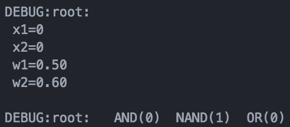
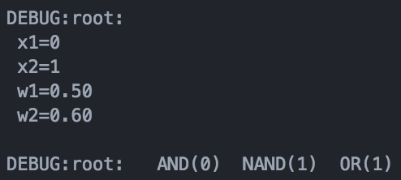
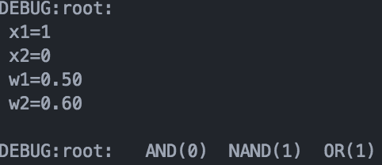
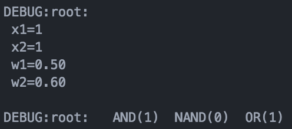

#2017.03.20 README

## INDEX
    1. Gate
    2. Filter

### 1. Gate
#### AND
```python
def AND(self, x1, x2):
    v1 = x1 * self.w1
    v2 = x2 * self.w2
    theta = max([v1, v2]) + 0.1

    result = v1 + v2 > theta

    return 1 if result else 0
```
x1w1 + x2w2 > theta = 1의 조건과 AND의 조건인 x1과 x2이 둘 다 1이여야 한다라는 조건을 동시에 만족하려면
각각의 `xn * wn` 중 어느 것보다도 theta값이 더 높아야 한다. 또한 모든 `xn * wn`값의 합보다는 작아야한다.

#### NAND
```python
def NAND(self, x1, x2):
    v1 = x1 * (self.w1 * -1)
    v2 = x2 * (self.w2 * -1)
    theta = min([v1, v2]) - 0.1

    result = v1 + v2 > theta

    return 1 if result else 0
```
NAND게이트는 AND게이트의 결과에 NOT게이트를 붙힌 것 처럼 동작하며 x1, x2이 둘 다 1일 경우에만 0을 반환한다.
AND게이트의 조건은 `각각의 xn * wn 중 어느 것보다도 theta값이 높아야한다`였으므로
이번에는 반대로 `각각의 xn * wn 중 어느 것 보다도 theta값이 낮아야한다`를 적용하고
input값이 높을수록 `xn * wn`은 낮아야하므로 주어진 w값에 -1을 곱해 음수로 바꿔준다.

#### OR
```python
def OR(self, x1, x2):
    # the theta must be 0
    v1 = x1 * self.w1
    v2 = x2 * self.w2
    theta = 0;

    result = v1 + v2 > theta

    return 1 if result else 0
```
OR게이트는 input중에 하나만 1이여도 1을 반환한다. 그 말은 바꿔말하면 input중 0이 아닌 것이 있으면,
즉 모든 `xnwn`의 값을 더하였을때 0보다 크면 1을 반환한다는 소리이다. 그래서 theta값을 0으로 설정하였다.

### RESULT






### 2. Filter
일단 이미 완성된 데이터셋을 시간이 경과함에 따라 점차적으로 들어오게 하기 위해
클래스를 하나 생성했다. 삉
```python
from __future__ import division
from functools import reduce

import os
import sys
import csv

import matplotlib as mpl
import matplotlib.pylab as plt

class FilterClass:
    def __init__(self, dataUrl):
        self.matrix = []
        self.data = []

        f = open(dataUrl, 'r')
        csvReader = csv.reader(f)

        for row in csvReader:
            self.matrix.append(row)
        self.getData()

        f.close()

    def getData(self):
        axisX = []
        axisY = []
        for i in self.matrix:
            axisX.append(float(i[0]))
            axisY.append(float(i[1]))

            self.data = [axisX, axisY]
```


================================================================

#### Average Filter
평균 필터는 새로운 데이터가 들어오면 전체의 평균을 다시 내는 필터이다.
그러나 새로운 데이터가 들어왔을 때 전체 리스트를 순회하면서 전체 평균을 다시 내는 방법은 너무 비효율적이므로
재귀식을 사용하여 전번 순회 때 계산했던 평균 값을 그대로 이용한다.

```python
def averageFilter(self):
    data = self.data
    tmp = []

    for i, v in enumerate(data[1]):
        newAvg = v * (1/(len(tmp) + 1))
        #새로운 데이터의 입장
        #전체 1/(tmp + 1)에 새로운 데이터를 곱해준다
        #그러면 새로운 데이터가 tmp리스트에 들어갔을 때의 평균 값이 나온다
        if len(tmp) > 0:
            newAvg = tmp[-1] * (len(tmp) / (len(tmp) + 1))
            newAvg += (v * (1 / (len(tmp) + 1)))
        tmp.append(newAvg)
        #tmp[-1]은 마지막으로 계산했던 평균값이다.
        #여기에 (지금길이 / 새로운 데이터님이 입장하신 후 길이)를 곱해준다
        #그 다음에 걍 더한 후 tmp의 tail로 넣어준다

    plt.plot(data[0], data[1]) #Original Data
    plt.plot(data[0], tmp, 'r') #Average Data
    plt.show()
```

### Moving Average Filter
새로운 데이터가 들어오면 일정 사이즈의 Queue를 가지고 그 사이즈 만큼의 평균을 구하는 필터이다.
이건 평균필터처럼 비효율이고 뭐고 할게 없기 때문에 그냥 짠다.

```python
def movingAverageFilter(self, size):
    data = self.data
    queue = []
    tmp = []
    firstVal = data[1][0]

    for i, v in enumerate(data[1]):
        queue.append(v)
        #새로운 데이터의 입장과 동시에 일단 큐에 넣어준다
        if(len(queue) == size):
            queueAvg = sum(queue, 0.0) / size
            queue.pop(0)
            tmp.append(queueAvg)
            #queue가 가득 찼다면 평균을 내준다
            #이제 필요없어진 queue의 머리를 차분하게 똑 따준다
            #tmp의 tail로 평균값을 넣어준다
        else:
            queueAvg = (sum(queue, 0.0) / size) + ((firstVal * (size - len(queue))) / size)
            tmp.append(queueAvg)
            #queue가 가득 차지 않았다면 새로운 데이터를 제외한 모든 값을 첫번째 데이터의 값으로 채워준다
            #그 다음 침착하게 평균을 낸 후 tmp의 tail로 넣어준다

    plt.plot(data[0], data[1]) #Original Data
    plt.plot(data[0], tmp, 'r') #Moving Average Data
    plt.show()
```


### RESULT
1. Average Filter

2. Moving Average Filter

사이즈가 커질 수록 노이즈가 없어져 그래프가 완만해지고
레이턴시가 심해지는 모습을 보인다.

size = 50

size = 20

size = 10

size = 5

